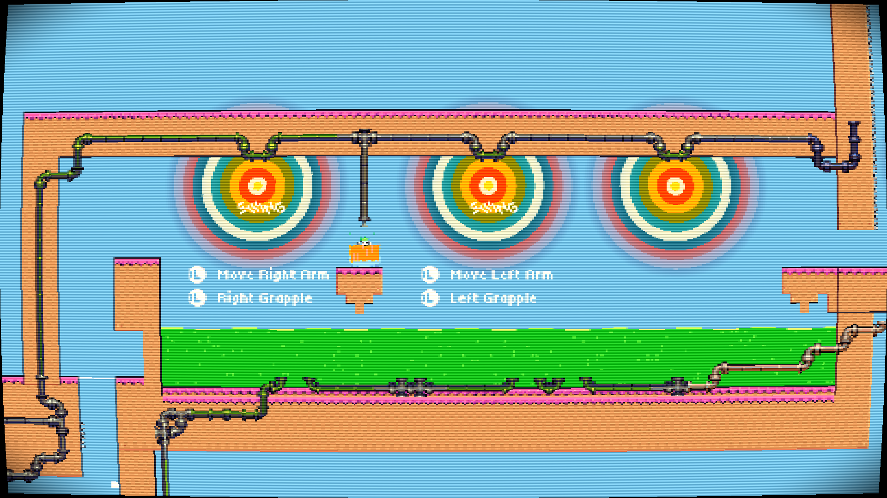
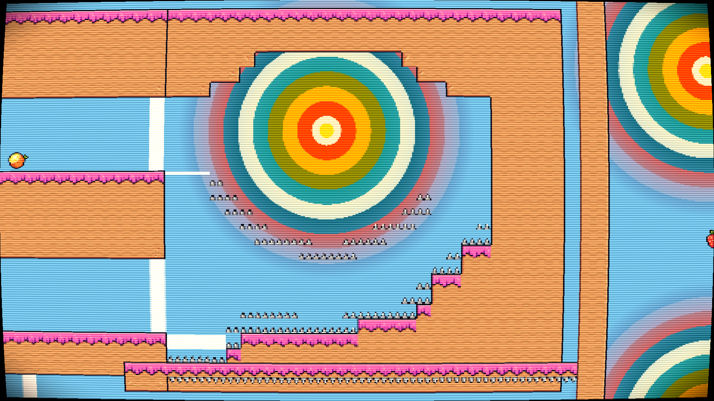
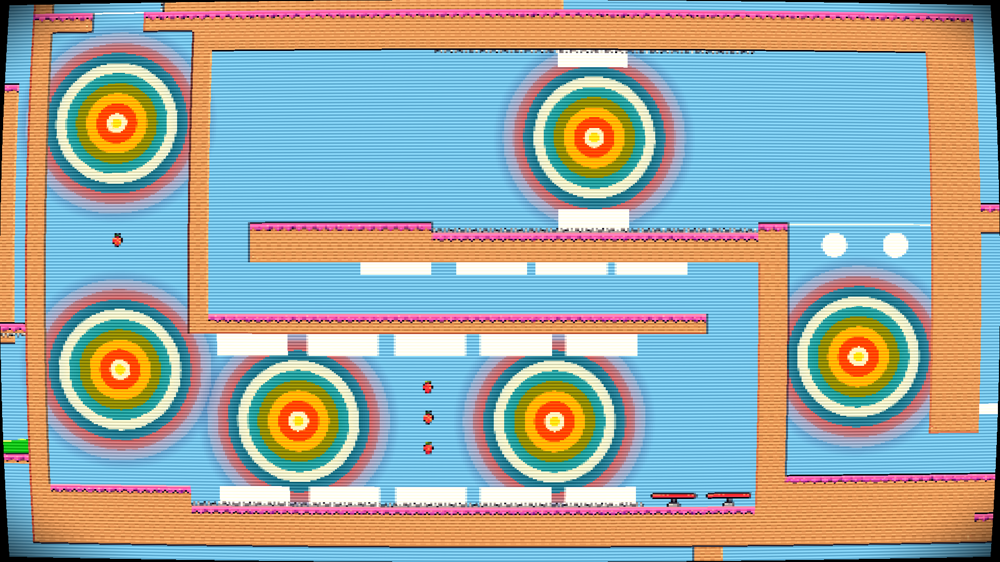

# Rock The Game — Oyun Tasarım Belgesi

*Sürüm 1.0 · 21 Eylül 2026 · Durum: geliştirme aşamasında (~22/60 oda hazır)*

---

## 1. Oyun bir bakışta

**Rock The Game**, iki kollu bir kanca (grappling hook) etrafında kurulmuş, hızlı ve zorlu bir 2D pixel-art platformer.

Oyuncu, birbirine bağlı odalardan geçerek ilerler. Her oda küçük bir bulmaca-refleks sınavıdır: sallan, fırla, tırman, hazard'ları atlat, bir sonraki odaya geç. Ölüm tek vuruşluktur ama respawn anındadır, yani "bir daha dene" hissi hiç kopmaz.

| | |
|---|---|
| **Tür** | 2D platformer, hız ve momentum odaklı |
| **Ana fikir** | Sallanmak, fırlamak ve tırmanmak için iki bağımsız kanca |
| **Hedef süre** | 2-3 saat |
| **Hedef boyut** | ~60 oda |
| **Platform** | PC, yalnızca gamepad |
| **Çok oyunculu** | Online, iki kişilik yarış (ayrıntılar sonra) |
| **Motor** | Unity 6 (URP, 2D) |

### Tek cümlelik vaat
> *Sallanırken uçuyormuş gibi hisset, düşerken "bir daha" de.*

---

## 2. Tasarım sütunları

Bir karar tereddütte kalırsa bu dört maddeye bakılır.

1. **Heyecan ve akış.** Oyuncu hareket ederken hızlanmalı, ritim bulmalı, bırakmak istememeli.
2. **Kanca her şeyin merkezinde.** Yeni bir mekanik ya da seviye fikri kancayla nasıl konuşuyor? Konuşmuyorsa gözden geçirilir.
3. **Zor ama adil.** Oyuncu ara sıra kızmalı ama hiçbir zaman "haksızlık" hissetmemeli. Ölüm hızlı ve ucuz, öğrenmek kolay olmalı.
4. **Oyunu mekanik ve seviye doldurur.** Hikâye yok. Çeşitlilik yeni mekaniklerden, yeni dünyalardan ve tuhaf seviye fikirlerinden gelir.

---

## 3. Hedef kitle ve his

**Kimler için?** Hem zorlu platformerları seven hardcore oyuncular hem de "zor oyunları pek oynamam ama bu ilgimi çekti" diyen orta seviye oyuncular.

**Nasıl hissettirmeli?** Zorluk seviye seviye artar. Oyuncu zaman zaman eğlenir, zaman zaman kızar. Bir odada kaç kez ölüneceği odanın zorluğuna göre değişir, sabit bir hedef yoktur.

**Erişilebilirlik.** Oyunun yumuşak tarafı Celeste'ten ilhamla eklenen koşma, zıplama, dash ve duvar tırmanma gibi "oyuncu dostu" mekaniklerdir. İleride kullanıcı dostu olmak adına mekanikler eklenip çıkarılabilir. Bir yardım modu (oda atlama, hız ayarı gibi) konuşuldu ama karar verilmedi (bkz. §12).

---

## 4. İlham

- **Celeste**: oda tabanlı yapı, tek vuruşta ölüm, hızlı respawn, dash, "zor ama adil" hissi.
- **Mario oyunları**: sınırsız yaratıcı dünyalar ve temalar.
- **Bilerek alınmayanlar**: Celeste'in hikâyesi ve kovalamaca sahneleri.

> Swing ve slingshot mekanikleri başka bir oyundan alınmadı. Bunlar geliştiricinin özgün fikridir. Proje yıllar önce yalnızca sallanarak hareket eden bir karakterle başladı, yürüme ve diğer hareketler sonradan eklendi.

---

## 5. Oynanış

### 5.1 Kontroller (gamepad)

| Tuş | Ne yapar |
|---|---|
| Sol stick | Hareket, dash yönü |
| Güney tuşu (A / ✕) | Zıplama |
| Batı tuşu (X / □) | Dash |
| **Sol tetik** | Sol kancayı fırlat / bırak |
| **Sağ tetik** | Sağ kancayı fırlat / bırak |
| Sol / sağ bumper | Soldaki / sağdaki duvara tutun |

### 5.2 Hareket seti

**Temel hareket**
- **Koşma ve zıplama.** Zıplama yüksekliği bastığın süreye göre değişir. Kenardan düştükten hemen sonra hâlâ zıplayabilirsin (coyote time), zıplama tuşuna biraz erken basmak da sayılır (jump buffer).
- **Dash.** Sol stick yönünde kısa, güçlü, yerçekimsiz bir atılma. Bir seferde **bir** hakkın var; yere inince ya da kancaya tutununca yenilenir.

**Kanca ailesi (oyunun kalbi)**
- **Tek kanca (swing).** Bir tetikle en uygun kanca noktasını (node) yakalarsın ve sarkaç gibi sallanırsın. Yerdeyken kancaya doğru küçük bir sıçrama yapar, sonra sallanmaya başlarsın.
- **Çift kanca (dual swing).** İki farklı noktaya aynı anda tutunursan, yay gibi gerilen ve savrulan bir hareket elde edersin.
- **Slingshot.** İki kancayı **aynı noktaya** bağlarsan karakter önce geri gerilir, sonra büyük bir hızla fırlar. Havada bir kez kullanılır; yere inince ya da özel bir toplanabilirle yenilenir.
- **Dönen node.** Bazı noktalar etrafında tam 360° döndüğünde ödül verir (örneğin hız patlaması).

**Duvar**
- **Tırmanma.** Bumper'ı basılı tutarak duvara tutunur ve tırmanırsın. Dayanıklılık (stamina) sınırlıdır (~6 sn), azalırken uyarı verir, yere inince dolar.
- **Kenardan çıkma (ledge climb).** Tırmanırken köşeye gelince karakter otomatik olarak üste çıkar.
- **Kayma.** Duvarda en fazla ~2 sn yavaşça kayabilirsin. Kayarken zıplayabilir, tırmanabilir, dash atabilir ya da kanca fırlatabilirsin.
- **Duvar zıplaması.** Duvardan dışarı doğru güçlü bir sıçrama.

**His (game feel)**
- Sert bir çarpmada kısa bir duraklama (hit-stop) ve gamepad titreşimi olur.
- Dash sırasında iz bırakan gölgeler, koşarken ve inerken toz efektleri vardır.
- Dash ve slingshot hakkı tükendiğinde karakterin rengi değişerek oyuncuyu bilgilendirir.

### 5.3 Ölüm ve yeniden doğma
- **Can barı yok.** Bir hazard'a temas edersen ölürsün.
- Respawn **anında** ve en son alınan checkpoint'te olur.
- Ölünce odadaki kırılan platformlar, hareketli tuzaklar ve anahtarlar başlangıç durumuna döner.
- Checkpoint öncesi toplanan ödüller ölünce kaybolur, checkpoint'e ulaşınca kalıcı olur.
- *Fikir aşamasında:* hamster topu benzeri, hasarı emen toplanabilir koruyucu. Bkz. §12.

---

## 6. Seviye tasarımı

### 6.1 Yapı
Oyun odalardan oluşur. Oyuncu bir kapıdan/çıkıştan diğer odaya geçer; geçiş sırasında kamera ve ekran akıcı biçimde değişir. Performans için yalnızca bulunduğun oda ve komşuları aktiftir.

Her odanın kendi checkpoint'i ve gerekirse kendi kamera ayarı (yakınlık/uzaklık) vardır. Odaların çoğunda kısa öğretici ipuçları bulunur.

### 6.2 Seviye elemanları

**Platformlar**
- **Hareketli platformlar** (düz, dairesel, hızlanan).
- **Tetiklenen platformlar**: üstüne basınca hareket eder.
- **Kırılan platformlar**: üstüne çıkınca titrer ve parçalanır; basılan yerden başlayarak dalga hâlinde kırılır, bir süre sonra yeniden oluşur.
- **Tek yönlü platformlar**: aşağıdan geçilir, üstünde durulur.
- **Fırlatma pedleri (launch pad)**: üstüne basınca belirli bir yönde fırlatır. Hareketli ve döngüsel versiyonları var.

**Tehlikeler**
- **Asit** ve akan asit.
- **Dönen, hızlanan, hareket eden ve sınırdan sınıra döngüyle akan ölümcül nesneler.**
- Düşman yok. Tehlike her zaman ortamdan gelir.

**Toplanabilirler**
- **Ananas/altın**: toplanan ödül; bazıları yere basmadan tek nefeste toplanmalıdır.
- **Anahtar parçaları**: hepsi toplanınca oda kapısını açar (ya da kapatır).
- **Slingshot yenileyici**: havada slingshot hakkını geri verir.
- **Kozmetik**: karakterin göz şeklini değiştirir.

**Diğer**
- **Kapılar** ve **anahtar-kapı bulmacaları.**
- **NPC'ler** (bkz. §7).

### 6.3 Hedef zorluk eğrisi
Şu an 22 oda mevcut. Sıklıkla kullanılan üçlü: **fırlatma pedi + hareketli/dönen ölümcül tuzak + tek yönlü platform**. Dönen node ve wrapping sistemleri nadir, "vitrin" mekanikler. 60 odaya çıkarken her yeni dünya/tema en az bir yeni ve ayırt edici mekanik tanıtmalıdır; ayrıntılı eğri henüz yazılmadı (bkz. §12).

---

## 7. Anlatı ve NPC'ler

Oyunda **hikâye yok.** Bilinçli bir tercih: oyunu bölüm tasarımı ve mekanik doldurur.

NPC'ler yalnızca kısa, esprili, çoğunlukla **4. duvarı yıkan** diyalog parçacıkları için var. Oyuncuyla doğrudan konuşmak istemediğin anlarda araya giren bir ses gibidirler. Bunlar zorunlu bir sistem değil; aklına geldikçe eklenecek bir baharattır.

Teknik olarak diyalog satırları yazılıyor gibi görünür, sırayla ya da rastgele oynatılabilir ve istenirse yalnızca oyuncu ölünce bir sonraki satıra geçer (yani ölmek diyalog ilerletmenin bir yolu olabilir).

---

## 8. Sanat yönü

**Genel çizgi.** Basit pixel art. Sanat kaynağı kısıtlı olduğu için bilerek yalın tutuluyor; şu anki görsellerin hiçbiri final değil.

**Ana karakter.** Bayram şekerinden esinlenmiştir. Şekerin iki ucundaki büzgülü poşetin biri **taç**, diğeri **pelerin** olmuştur. Sevimlidir, ama oyunun tamamı sevimli olmak zorunda değildir.

**Dünyalar ve ton.** Şu ana kadar yapılan tüm odalar **yeşil, pis bir asit** ortamında geçiyor. İleride birbirinden çok farklı, kimi zaman birbiriyle uyumsuz temalı dünyalar gelecek. Uyumsuz tonların yan yana durması bilinçli bir tercih. Hedef, Mario'daki gibi sınırsız yaratıcı bir dünya.

**NPC'ler.** Çocuk kitaplarından taranmış basit illüstrasyonlar; Unity'de kemik eklenerek canlandırılır. Pixel art dünyayla bilerek çatışan bir stil karışımı.

**Ekran efekti.** **CRT filtresi kalıcıdır**: çocukluktaki tüplü televizyon hissi verir, post-process ile birlikte görüntüyü toparlar.

**Ses ve müzik.** Şu an geçici. Retro/chiptune ağırlıklı parçalar ve temel SFX'ler mevcut, ileride değiştirilecek.

### 8.1 Görsel Referanslar

`NewScene.unity` içindeki 22 odanın Game view çekimleri `docs/moodboard/level_01.png` … `level_22.png` dosyalarında durur. Her oda tamamen kadraja alınmış, CRT filtresi dahil, 1920×1080 çekildi. Oyuncu, HUD, partikül ve hareket yoktur. Odalar oyun içi kameradan yaklaşık 2-5 kat uzaktan görünür. Aşağıdaki değerlendirme 22 görselin 9'una (01, 02, 05, 09, 12, 13, 16, 19, 22) bakılarak yapıldı ve §1-§3 ile §8'deki hedeflerle karşılaştırıldı.

**Görsel dil.** Düz gökyüzü mavisi arka plan; pembe kremalı turuncu zemin; koyu boru dekoru; gökkuşağı halkalı, parlayan kanca node'ları; parlak yeşil asit şeritleri; kırmızı fırlatma pedleri; gümüş dikenler; turuncu ananas.

**Hedeflerle tutarlı olanlar**

| Hedef | Görselde ne görünüyor |
|---|---|
| Kanca her şeyin merkezinde (§2) | Node'lar odaların en baskın ve en okunur öğesi; oyuncunun gözü ilk oraya gidiyor. |
| Bilerek yalın pixel art (§8) | Düz renk alanlar, az doku, sade şekiller. |
| Kalıcı CRT filtresi (§8) | Tarama çizgileri, vinyet ve hafif ekran eğriliği tüm odalarda var; tüplü TV hissi veriyor. |
| Şimdilik tek dünya (§8) | 22 oda aynı paleti paylaşıyor. |
| Sevimli ama hepsi sevimli olmak zorunda değil (§8) | Sevimli taraf güçlü (şeker/kurabiye tonları); sevimsiz taraf henüz görünmüyor. |

**Uyumsuzluk ve belirsizlikler**

1. **"Yeşil, pis asit" tanımı görselle örtüşmüyor.** §8 tüm odaların yeşil, pis bir asit ortamında geçtiğini söylüyor. Görselde baskın renkler mavi, turuncu ve pembe; yeşil yalnızca asit şeritlerinde ve bazı borularda, o da temiz ve doygun bir yeşil. Ortam "pis" değil, parlak ve şekerli. Ya metin görsele göre ya da sanat metne göre güncellenmeli. Hangisinin doğru olduğu geliştiricinin kararı.
2. **Beyaz dikdörtgenler ve daireler.** Odalar 2, 9, 12, 16, 19 ve 22'de düz beyaz blok ve daireler var (bazı node'ların altında ve üstünde, platform hizasında). Bunların placeholder mı, tetikleyici görseli mi, bilerek mi olduğunu kodda doğrulamadım. Bugünkü hâliyle bitmemiş görünüyorlar ve yalın çizgiden farklı duruyorlar.
3. **Piksel ölçeği ve yazı tipi tutarsızlığı.** Öğretici yazıları en az iki farklı yazı tipi ve boyutunda ("USE L TO JUMP" ile "Move Right Arm"; "JUMP" döndürülmüş). Node'lar, borular ve zemin kremasının piksel yoğunlukları birbirinden farklı; 22. odadaki arazi kenarları basamaklı. "Basit pixel art" hedefiyle çelişmiyor ama bilerek yapılmış bir karışım gibi de durmuyor.
4. **Tehlike okunurluğu belirsiz.** Oda 9'daki gümüş dikenler turuncu zemine karşı küçük ve soluk (22. odadaki dikenler daha büyük ve net). Ama çekimler oyun içi zoom'dan 2-5 kat uzak, gerçek oyunda daha büyük görünürler. "Zor ama adil" (§2) için oyun içi kamerayla ayrıca kontrol edilmeli. Asit ise parlak yeşili sayesinde çok net okunuyor.
5. **Arka plan düz.** Gökyüzü tek düz mavi, derinlik veya parallax yok. Bu bir hata değil, ama "uçuyormuş gibi hisset" vaadini görsel olarak desteklemiyor.

**Bu görsellerle değerlendirilemeyenler**
- **Game feel:** hit-stop, titreşim, toz, dash gölgeleri, hız ve akış hissi. Durağan Edit Mode çekimlerinden görünmez.
- **Ana karakter:** yalnızca oda 5'te çok küçük bir görünüm var.
- **NPC illüstrasyonları:** hiçbir çekimde yok.
- **Çoklu dünya ve uyumsuz tonlar:** henüz yok.

Bunlar için Play Mode'da oyun içi kameradan (oyuncu ve HUD dahil, `source=screen`) yeni çekim gerekir.

---

## 9. Çok oyunculu (taslak)

> Ayrıntılar daha sonra verilecek. Bu bölüm şu anki fikri kaydeder.

**Yarış modu.** İki oyuncu oyunun tamamını yarışarak geçer. Her odanın sonunda bir **bayrak** vardır. **3 bayrak toplayan oyuncu rakibini 1 oda geriye gönderir.** Başka bir etkileşim yoktur; iki oyuncu birbirini engellemez, sadece "beraber oynuyormuş" hissi yaşar.

**Alternatif.** Bayrak kapmacasının olmadığı, iki kişinin yalnızca birlikte oynadığı bir hâl.

**Kurallar**
- Oyun **online** olacak.
- **Her oyuncu kendi odasını görür**, respawn anında olur.
- İki oyuncu aynı odadaysa birbirlerini görürler.

**Teknik durum.** Şu an projede **ağ altyapısı yok.** Mevcut oda, respawn ve kamera sistemleri tek oyuncu düşünülerek yazılmış; iki oyuncunun farklı odalarda olabilmesi bu yapıyı önemli ölçüde etkiler. Bu karar 60 oda tamamlanmadan verilirse odaları sonradan uyarlamak daha ucuza gelir.

---

## 10. Teknik özet

- **Motor:** Unity 6000.3, URP 2D, Cysharp UniTask, DOTween, New Input System.
- **Oyuncu:** Kinematik karakter; durum makinesi (yerde, havada, dash, swing, dual swing, slingshot, duvar tırmanma, kayma, kenar çıkma, oda geçişi).
- **Veri:** Karakter ayarları tek bir ScriptableObject'te (`PlayerStatsSO`); ses, titreşim ve toplanabilirler de ScriptableObject tabanlı.
- **Sinyaller:** Sistemler arası iletişim olay kanallarıyla (ScriptableObject) yapılır.
- **Aktif kod:** `Assets/Scripts/New-Scripts/`. `Assets/Scripts/` altındaki dosyalar eski prototiptir ve kullanılmaz.
- **Ana sahne:** `NewScene.unity` (build'deki tek sahne, 23 oda prefab'ı).

---

## 11. Şu anki durum

| Alan | Durum |
|---|---|
| Hareket seti (koşma, zıplama, dash, swing, slingshot, duvar) | ✅ Tamam |
| Oda sistemi, checkpoint, respawn | ✅ Tamam |
| Platform ve tehlike çeşitleri | ✅ Geniş bir set hazır |
| Toplanabilirler, anahtar-kapı | ✅ Var |
| Oda sayısı | 🟡 ~22 / 60 |
| NPC diyalogları | 🟡 Sistem hazır, içerik az |
| Ana menü, pause, ayarlar, bitiş | ❌ Yok |
| Kalıcı kayıt (save) | ❌ Yok |
| Online çok oyunculu | ❌ Yok |
| Final sanat, ses ve müzik | ❌ Geçici |
| Diğer dünyalar / temalar | ❌ Henüz yok (yalnızca asit dünyası) |

---

## 12. Açık kararlar ve riskler

**Kararlar bekleyenler**
1. **Assist / yardım modu** olacak mı? Hem hardcore hem orta seviye hedeflendiği için bu önemli bir karar.
2. **Hamster topu** koruyucusu yapılacak mı? Yapılırsa tek vuruşta ölüm felsefesini ve zorluk dengesini değiştirir.
3. **Çok oyunculu:** yarış mı, yalnızca birlikte oynama mı, ikisi birden mi? Aynı odada oyuncular birbirini engeller mi?
4. **Toplanabilirlerin amacı:** ananas/altın neye yarıyor? Şu an yalnızca sayaç gibi görünüyor.
5. **60 odalık zorluk ve mekanik tanıtım eğrisi**: hangi dünyada hangi mekanik tanıtılacak?
6. **Yerden swing yalnızca sağ tetikle** çalışıyor gibi görünüyor. Bilinçli mi, eksik mi?

**Riskler**
- **Ses/müzik lisansları:** Klasördeki parçaların bir kısmı üçüncü taraf (örn. Disney kısa filminden "The Skeleton Dance") ve ticari yayında sorun çıkarabilir. Yayın öncesi hepsi lisanslı, kendi yapımı ya da telifsiz olanlarla değiştirilmeli.
- **Ağ mimarisi:** Yukarıda §9'da anlatıldığı gibi.
- **Kapsam:** ~22 oda kaldığı için 38 oda daha üretmek gerekiyor. Asit dışında tema olmaması, çeşitlilik açısından da risk taşıyor.
- **Kod temizliği:** `Room.cs` bir editor namespace'ini (`EasyTextEffects.Editor...`) import ediyor; build'de sorun çıkarabilir. Eski prototip dosyaları (~25 adet) ve kullanılmayan sahneler temizlenebilir.

---

## 13. Kaynaklar

Bu belge, ilk GDD taslağı, projenin kaynak kodu, sahneleri ve prefab'larının taranması ile geliştiriciyle yapılan vizyon görüşmesinden derlendi. Görsel referanslar `docs/moodboard/` klasöründedir.
